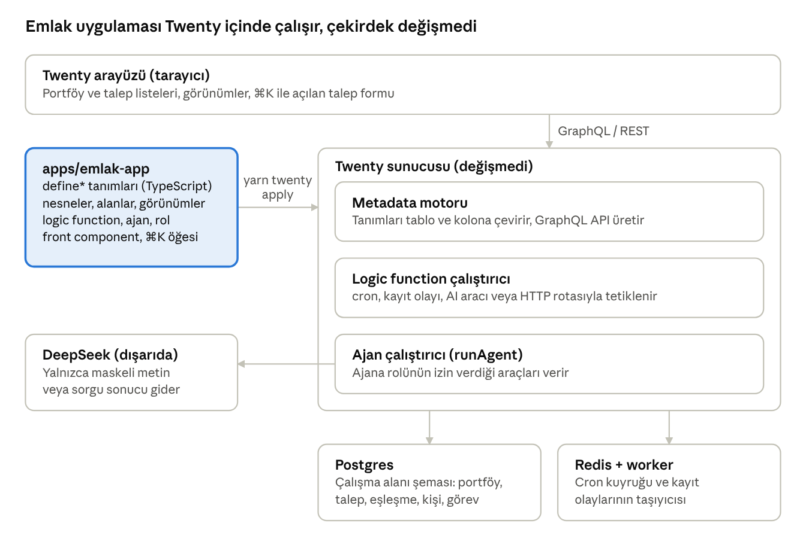

# PR #1 Okuma Rehberi

8 Ekim 2026 · PR: [oguz-kara/real-estate-crm#1](https://github.com/oguz-kara/real-estate-crm/pull/1)

Bu PR, Twenty'nin çekirdeğine dokunmadan emlak ofisine özel bir CRM kuruyor. Bütün iş `apps/emlak-app/` içindeki bir Twenty SDK uygulamasında. 217 dosyanın yaklaşık 9 bin satırı uygulama kodu, gerisi doküman, eval raporları, veri ve `yarn.lock`. Bu rehber her dosya grubunun ne yaptığını, neden eklendiğini ve Twenty'nin hangi parçasına bağlandığını anlatıyor.

## Büyük resim

Twenty'yi bir alışveriş merkezi binası gibi düşün. Bina (sunucu, veritabanı, arayüz) hazır; biz binanın içine kendi dükkânımızı açtık. Duvarları yıkmadık, tesisata dokunmadık. Dükkânın tabelası, rafları ve çalışanları `apps/emlak-app/` klasöründe tanımlı.

Bu yüzden PR'daki hiçbir dosya `packages/twenty-server` veya `packages/twenty-front` içinde değil. Tek istisna `packages/twenty-utils/preview-deploy.sh`, o da sadece bir yardımcı script.

Dükkân binaya şöyle bağlanıyor:

1. **Manifest.** `apps/emlak-app/src/` içindeki her dosya bir `define*` çağrısıyla bir parça tanımlar: nesne, alan, görünüm, rol, ajan, logic function, komut menüsü. Bunlar düz TypeScript nesneleridir, kendi başlarına hiçbir şey çalıştırmazlar.
2. **`yarn twenty apply`.** SDK bu tanımları toplar, bir manifest üretir ve Twenty sunucusuna gönderir. Sunucu manifesti okur, veritabanında tablolar ve kolonlar açar, menüye görünüm ekler, ajanı ve rolleri kaydeder.
3. **Çalışma zamanı.** Kaydedilen logic function'ları sunucu çalıştırır: gece cron'u, kayıt değişince tetiklenen olay, AI aracı veya HTTP rotası olarak. Front component'leri de arayüz bir iframe benzeri kum havuzunda çizer.

Bunun önemli bir sonucu var. Twenty'yi güncellediğimizde dükkânımız yerinde kalır, çünkü binanın hiçbir duvarını değiştirmedik. Bedeli de şu: Twenty'nin SDK'sının izin vermediği bir şeyi yapamıyoruz. PR'daki birçok tasarım kararı bu sınırdan doğdu; ilgili bölümlerde "Twenty bağlantısı" başlığı altında anlattım.

Aşağıdaki çizim parçaların birbirine nasıl bağlandığını gösteriyor.

Vurgulu kutu bu PR'ın kendisi; geri kalan her şey Twenty'nin olduğu gibi kullanılan parçaları. Yapay zekâ sağlayıcısı DeepSeek'e giden tek yol ajan çalıştırıcısı.

## Okuma sırası

PR'ı dosya listesinin sırasıyla okursan 217 dosyanın içinde kaybolursun. GitHub dosyaları alfabetik dizer; oysa kod katman katman inşa edildi. Bu sırayla oku:

1. `apps/emlak-app/src/application-config.ts`, `src/default-role.ts`, `src/constants/universal-identifiers.ts`. Uygulamanın kimliği ve yetkisi. Beş dakika sürer.
2. `src/objects/` ve `src/fields/`. Veri modeli: portföy, talep, eşleşme ve Kişi'ye eklenen alanlar. Her şey bunların üstüne kurulu.
3. `src/constants/`. Seçenek listeleri ve sabit kimlikler. Özellikle `property-options.ts` ve `app-locale.ts`.
4. `src/import/` ve `scripts/import-sahibinden.ts`. Gerçek verinin sisteme nasıl girdiği.
5. `src/search/` ve `src/matching/`. Arama filtresi ve eşleştirme motoru; burada saf fonksiyonlar ve testleri var.
6. `src/follow-up/`. Takip taraması.
7. `src/logic-functions/`. Yukarıdaki çekirdeklerin Twenty'ye bağlandığı ince kabuklar.
8. `src/agents/`, `src/roles/`. Yapay zekâ ajanları ve yetki sınırları.
9. `src/intake/`, `src/front-components/talep-cikar-form.front-component.tsx`, `src/command-menu-items/`. En yeni özellik, metinden talep girişi.
10. `src/views/`, `src/navigation-menu-items/`, `src/indexes/`. Arayüz ve veritabanı ayrıntıları.
11. `evals/` ve `scripts/run-*-eval.ts`. Yapay zekâ davranışını ölçen testler.

Dokümanları (`docs/`) kodu okurken açık tut. Her özelliğin "neden"i `docs/superpowers/specs/` altındaki spec'te yazıyor.

## Twenty SDK sözlüğü

PR'daki dosyaların çoğu tek bir `define*` çağrısı dışa aktarır. Bu tabloyu bir kez okursan dosya adlarından ne yaptıklarını tahmin edebilirsin.

| Parça | Ne yapar | Bizde nerede |
| --- | --- | --- |
| `defineApplication` | Uygulamanın kimliği: ad, açıklama, sabit UUID | `src/application-config.ts` |
| `defineApplicationRole` | Uygulamanın kendi kodunun (logic function'ların) yetkisi | `src/default-role.ts` |
| `defineObject` | Yeni bir veri nesnesi, yani yeni bir tablo ve arayüzde yeni bir menü | `src/objects/*.object.ts` |
| `defineField` | Var olan bir nesneye alan ekler; Person gibi standart nesnelere ve ilişkilerin iki ucuna | `src/fields/*.field.ts` |
| `defineIndex` | Veritabanı indeksi; biz tekillik (unique) garantisi için kullanıyoruz | `src/indexes/` |
| `defineView` | Kayıt listesinin hazır bir görünümü: filtre, kolonlar, sıralama | `src/views/` |
| `defineNavigationMenuItem` | Sol menüdeki bir girdi | `src/navigation-menu-items/` |
| `definePageLayout` | Bir sayfanın sekme ve widget düzeni | `src/page-layouts/main-page.page-layout.ts` |
| `defineFrontComponent` | Twenty arayüzünde çalışan kendi React bileşenimiz | `src/front-components/` |
| `defineCommandMenuItem` | Komut menüsüne (⌘K) bir eylem ekler ve bir front component açar | `src/command-menu-items/` |
| `defineLogicFunction` | Sunucuda çalışan kodumuz. Tetikleyicisi cron, veritabanı olayı, AI aracı veya HTTP rotası olabilir | `src/logic-functions/` |
| `defineHealthCheck` | Uygulama ayakta mı sorusuna cevap veren küçük fonksiyon | `src/logic-functions/health-check.ts` |
| `defineRole` | Bir ajana bağlanabilen yetki kümesi | `src/roles/` |
| `defineAgent` | Model, sistem talimatı ve rolüyle bir yapay zekâ ajanı | `src/agents/` |

Üç kavram daha her yerde karşına çıkacak:

- **`universalIdentifier`.** Her parçanın sabit bir UUID'si var. Twenty bir şeyin "aynı parça" olduğunu adından değil bu kimlikten anlar. Bir alanın adını değiştirsen bile UUID aynı kaldıkça sunucu onu yeniden adlandırır, silip yeniden açmaz. Bu yüzden kimlikler `src/constants/*-ids.ts` dosyalarında toplu duruyor ve asla elle değiştirilmiyor.
- **`CoreApiClient` ve `MetadataApiClient`.** Logic function'ların veriye erişim yolu. Core, kayıtları (kişi, portföy, görev) okuyup yazar. Metadata, ajan çalıştırmak gibi platform işlerini yapar. İkisi de uygulamanın kendi rolüyle çalışır.
- **`metadataLabel` ve `trLabel`.** Etiketleri iki dilli yazmamızı sağlayan yardımcılar. Özellik 4'te anlattım.

## Repo kökündeki değişiklikler

Kökte sadece altı dosya değişti. Hiçbiri çalışan uygulamayı etkilemiyor; hepsi geliştirme düzeniyle ilgili.

| Dosya | Ne değişti | Neden |
| --- | --- | --- |
| `CLAUDE.md` | Yapay zekâ atfı yasağı sertleşti; commit yazarının `oguz-kara` olması şartı ve "Kısa süreli deploy et" komutunun tanımı eklendi | Bulut ortamı commit'leri varsayılan olarak Claude adına atıyordu. Kural, Claude Code'un bu repoda her oturumda okuduğu dosyaya yazıldı |
| `.gitignore` | `.superpowers/` ve `.preview-deploy/` eklendi | İlki plan yürütürken tutulan geçici defter, ikincisi önizleme scriptinin indirdiği ikili dosya. İkisi de commit'lenmemeli |
| `.claude/settings.json` | Önizleme scriptine çalışma izni | Senin "kural ekle" isteğin. Claude Code'un izin denetleyicisi dışa açılan tünelleri varsayılan olarak engelliyor |
| `packages/twenty-utils/preview-deploy.sh` | Yeni: cloudflared ile geçici, herkese açık önizleme tüneli kurar ve kaldırır | Uygulamayı kurmadan birine göstermek için denendi. Bulut konteynerinin ağı 7844 portunu kapattığı için burada çalışmıyor; kendi bilgisayarında çalışır |
| `docs/PREVIEW-DEPLOY.md` | Yeni: scriptin prosedürü ve neden bulutta çalışmadığı | Aynı denemeyi bir daha yapmamak için kayıt |
| `LOCAL-SETUP.md` | Yeni: Mac'te kurulumun nasıl yapıldığı | İlk günün notları. Portlar (5433, 6380, 3002) o makinedeki çakışmalar yüzünden seçildi; temiz kurulumda varsayılanlar kullanılır |

İncelerken şunu sor: `preview-deploy.sh` `.env` dosyalarını değiştiriyor ve uygulamayı herkese açıyor. `down` çalıştırılmazsa açık kalır. Bu yüzden script her çalışmada uyarı basıyor ve CLAUDE.md'de ayrıca belgelendi.

## Uygulama iskeleti

`apps/emlak-app/` klasörü Twenty'nin resmî `create-twenty-app` şablonuyla oluşturuldu. Bu dosyaların çoğunu biz yazmadık, şablon üretti. İncelerken "bunu kim neden yazdı" sorusunun cevabı genelde "şablon" olacak.

| Dosya | Kaynak | Ne işe yarar |
| --- | --- | --- |
| `package.json` | Şablon + biz | Komutlar: `twenty`, `lint`, `typecheck`, `test:unit`, `import:sahibinden`, `seed:portfolio`, `i18n:extract`, `i18n:fill`, `eval:chat`, `eval:intake` |
| `yarn.lock` | Otomatik | Uygulamanın kendi bağımlılık kilidi. 3.364 satır; okumana gerek yok |
| `tsconfig.json`, `tsconfig.spec.json` | Şablon | `src/...` biçiminde mutlak importları mümkün kılar; spec olanı testleri, eval'ları ve script'leri de typecheck'e katıyor |
| `vitest.unit.config.ts` | Biz | Sunucu gerektirmeyen birim testleri (`*.test.ts`) |
| `vitest.config.ts`, `src/__tests__/global-setup.ts`, `src/__tests__/schema.integration-test.ts` | Şablon | Çalışan bir Twenty'ye karşı entegrasyon testi. `vitest.config.ts` içindeki API anahtarı Twenty'nin herkese açık geliştirme anahtarıdır, sır değil |
| `.oxlintrc.json`, `.nvmrc`, `.yarnrc.yml`, `.gitignore` | Şablon | Lint kuralları, Node 24.5.0, Yarn ayarı |
| `.github/workflows/ci.yml`, `cd.yml`, `publish.yml` | Şablon | Uygulama ayrı bir repo olsaydı CI/CD olurdu. GitHub yalnızca repo kökündeki `.github` klasörünü okur, yani bu üçü bu repoda hiç çalışmaz |
| `README.md`, `SETUP.md`, `CHANGELOG.md` | Şablon | Henüz doldurulmadı. README hâlâ "My Twenty App" diyor |
| `AGENTS.md`, `CLAUDE.md` | Şablon | Yapay zekâ kod asistanları için Twenty uygulama dokümanlarının linkleri |
| `public/logo.svg` | Şablon | Uygulama logosu |
| `src/application-config.ts`, `src/constants/universal-identifiers.ts` | Şablon + biz | Uygulamanın adı ("Emlak") ve sabit kimlikleri |
| `src/default-role.ts` | Şablon + biz | Logic function'ların yetkisi. Biz tüm kayıtları okuma, güncelleme ve yumuşak silmeyi açtık; kalıcı silme kapalı. Talep girişi için AI izin bayrağı da eklendi |
| `src/front-components/main-page.tsx`, `src/page-layouts/main-page.page-layout.ts`, `src/navigation-menu-items/main-page.navigation-menu-item.ts` | Şablon | Sol menüdeki "Emlak" sayfası. Şu an Twenty'nin örnek karşılama ekranını gösteriyor; işlevi yok |
| `src/logic-functions/health-check.ts` | Şablon | Sunucuya "uygulama sağlıklı" der |

`default-role.ts` dosyasını dikkatle oku. Bu rol logic function'ların kimin adına yazdığını belirliyor. Gece taramaları görev oluşturabiliyorsa, bu dosyadaki `canUpdateAllObjectRecords: true` sayesinde.

## Özellik 1: Portföy, sahibinden içe aktarma ve arama

**Problem.** Ofisin portföyü sahibinden.com'da duruyor. Twenty'nin hazır nesneleri (Kişi, Şirket, Fırsat) bir daireyi anlatamaz: oda sayısı, kat, ısınma, aidat, tapu durumu yok. Bir danışman "Bornova'da 3+1, kombili, 5 milyon altı" diye filtrelemek istediğinde bunların her biri gerçek bir alan olmalı. Metin içinde aramak yetmez.

**Çözüm.** Sahibinden'in ilan şemasını birebir karşılayan tek bir `property` (Portföy) nesnesi tanımladık. Kategori, alt tür, ilan tipi, fiyat, ilçe/mahalle, metrekare, oda, kat, ısınma gibi yaklaşık 45 tipli alan var. İç, dış, muhit, ulaşım, manzara gibi özellik grupları da ayrı çoklu seçim (multi-select) alanları. Sonra sahibinden dışa aktarım dosyasını bu nesneye çeviren bir içe aktarıcı yazdık. Son olarak aynı filtre mantığını hem arayüzün hazır görünümlerine hem de yapay zekâ aracına verdik.

**Tasarım kararları ve nedenleri.**

- **Seçenek etiketleri sahibinden'in ham Türkçe metni.** "6-10 arası" bina yaşı sayıya çevrilmedi, olduğu gibi bir seçenek. Böylece içe aktarma birebir eşleşir ve hiçbir bilgi sıkıştırılmaz.
- **İçe aktarma bir logic function değil, bir CLI script'i.** Büyük dosya ve zaman aşımı riskini sunucuya taşımamak, hatayı yerelde ayıklayabilmek için. Çekirdek fonksiyonlar saf olduğu için ileride uygulama aracına sarılabilir.
- **Sessiz veri kaybı yasak.** Eşlenemeyen her değer hem bir kalibrasyon raporuna hem de kaydın `importNotes` alanına yazılır. İlk çalıştırma hep `--dry-run`; rapor temizlenene kadar seçenek listesi genişletilir.
- **Tekrar çalıştırmak güvenli (idempotent).** Sahibinden ilan no'su `externalId` alanına yazılır ve tekil bir indeksle korunur. Aynı dosya iki kez aktarılırsa kayıtlar çoğalmaz, güncellenir.
- **Tek çeviri noktası.** `buildPropertyFilter` parametreleri Twenty'nin GraphQL filtresine çeviren tek fonksiyon. Arama aracı da eşleştirme motoru da bunu kullanır; sonuçların birbirinden sapması mümkün olmaz.

**Twenty bağlantısı.** `property` bir `defineObject`; Twenty onun için tablo, GraphQL tipleri, liste ve detay ekranı üretiyor. Mal sahibi ilişkisi standart Person nesnesine bağlanıyor. Person'ın dosyasını değiştiremediğimiz için ilişkinin iki ucu `src/fields/` altında ayrı `defineField` olarak tanımlı. Arama aracı `toolTriggerSettings` ile Twenty'nin AI sohbetine ve MCP'ye açılıyor.

| Dosya | Ne yapar |
| --- | --- |
| `src/objects/property.object.ts` | Portföy nesnesi ve tüm alanları |
| `src/constants/property-options.ts` | Bütün seçenek listeleri (kategori, oda, ısınma, özellik grupları) ve sahibinden etiketi → kod eşlemesi. 497 satır; projenin sözlüğü |
| `src/constants/property-field-ids.ts` | Portföy alanlarının sabit kimlikleri |
| `src/fields/owner-on-property.field.ts`, `owned-properties-on-person.field.ts` | Portföy ↔ mal sahibi (Kişi) ilişkisinin iki ucu |
| `src/indexes/property-external-id.index.ts` | `externalId` tekilliği; tekrar aktarmanın güvencesi |
| `src/views/aktif-portfoy.view.ts`, `satilik-konut.view.ts`, `kiralik-konut.view.ts`, `arsalar.view.ts` | Hazır filtreli liste görünümleri |
| `src/navigation-menu-items/properties.navigation-menu-item.ts` | Sol menüdeki "Portföyler" |
| `scripts/import-sahibinden.ts` | CLI giriş noktası: dosyayı okur, normalleştirir, doğrular, aktarır, rapor yazar |
| `src/import/normalize-listing.ts` | Bir ham ilanı portföy kaydına çeviren ana fonksiyon |
| `src/import/parse-*.ts` | Tek işli yardımcılar: fiyat, adres, koordinat, kat, evet/hayır |
| `src/import/map-categories.ts`, `map-features.ts`, `structural-feature-keys.ts` | Kategori ve özellik eşlemeleri |
| `src/import/upsert-properties.ts` | REST ile var olanı günceller, yoksa oluşturur. API'nin dakikada 100 istek sınırı için bekleyip yeniden dener |
| `src/import/import-report.ts`, `raw-listing.type.ts` | Rapor yazımı ve ham ilan tipi |
| `src/search/build-property-filter.ts`, `property-search-params.type.ts` | Ortak filtre çevirmeni |
| `src/logic-functions/search-properties.ts` | `search_properties` AI aracı |
| `fixtures/sahibinden-sample.json` | Testler için küçük örnek ilan dosyası |
| `data/sahibinden-izmir-2026-10-06.json` | Gerçek 41 ilanlık dışa aktarım; `yarn seed:portfolio` bunu yükler. Dikkat bölümüne bak |
| `src/import/__tests__/*`, `src/search/__tests__/*`, `src/constants/__tests__/property-options.test.ts` | Gerçek dışa aktarım değerleriyle tablo testleri. `calibration-2026-10-06.test.ts` gerçek dosyanın ilk kuru çalıştırmasında çıkan 145 eşlenemeyen anahtarın çözümlerini sabitler |

**Neye dikkat et.** `parse-floor.ts` içinde "0" değerinin kaybolmaması için açık bir sayı kontrolü var. Eski bir script'te `parseInt(x) || null` yazıldığı için geçerli bir 0 değeri `null` oluyordu, çünkü JavaScript'te 0 "yanlış" sayılır. Bunun için regresyon testi de var. Küçük bir satır ama bu tür hataların nasıl sakladığının iyi bir örneği.

## Özellik 2: Takip hatırlatmaları

**Problem.** Emlakçılıkta müşteri kaybetmenin en sık yolu unutmaktır. Sıcak bir alıcıyla üç gün konuşulmazsa başka ofise gider. Kimin aranması gerektiğini kafada tutmak 20 kişiden sonra imkansızlaşır.

**Çözüm.** Kişi kaydına bir takip aşaması ekledik: Sıcak (3 gün), Ilık (7 gün), Uzun Vadeli (30 gün). Her gece 03:15'te bir tarama, aşaması olan herkes için son temastan bu yana geçen günleri hesaplar. Eşik aşılınca durum "Vadesi Geldi", iki katı aşılınca "Gecikmiş" olur. Kişi ilk kez eşiği aştığında tek bir görev açılır. "Takip Bekleyenler" görünümü de aranacakları tek listede toplar.

**Tasarım kararları ve nedenleri.**

- **Temas = not veya tamamlanmış görev.** Telefon numarasını düzeltmek temas sayılmaz. Pipedrive'ın bilinen bir sorunu, her alan düzenlemesini temas sayması. Biz kasten dışladık; ekstra disiplin gerekmez, ofis zaten görüşmeden sonra not düşüyor.
- **Gecikme başına tek görev, her gece değil.** `followUpTaskCreatedAt` alanı bir işaretçi. Görev açılınca şimdiki zamana yazılır; kişi gecikmiş kaldıkça yeni görev açılmaz. Yeni bir temas işaretçiyi geçerse sistem bir sonraki gecikmeye yeniden hazır olur. Bu, asansör düğmesine on kez basmanın onu on kez çağırmaması gibi: aynı durum aynı sonucu üretir.
- **Mantık saf fonksiyonlarda.** `computeFollowUpStatus` ve `shouldCreateTask` veritabanı görmez, sadece tarih ve aşama alır. Böylece her durum milisaniyede tablo testleriyle denenebilir. Veritabanıyla konuşan kısım `run-sweep.ts` içinde, sahte bir istemciyle test ediliyor.
- **Eşikler tek dosyada.** 3/7/30 değerleri `follow-up-thresholds.ts` içinde. Ofis farklı isterse tek satır değişir.

**Twenty bağlantısı.** Dört alan standart Person nesnesine `defineField` ile ekleniyor. Tarama `cronTriggerSettings` (gece 03:15) ve `toolTriggerSettings` ile tanımlı; yani AI sohbetinden "takip taramasını şimdi çalıştır" da denebilir. Görevler Twenty'nin kendi Task nesnesine, `taskTarget` ile kişiye bağlanarak yazılıyor.

| Dosya | Ne yapar |
| --- | --- |
| `src/fields/follow-up-stage.field.ts` | Aşama seçimi; boşsa kişi takip edilmez |
| `src/fields/follow-up-status.field.ts` | Takipte / Vadesi Geldi / Gecikmiş. Sadece tarama yazar |
| `src/fields/last-touched-at.field.ts` | Son temas tarihi; bilgi amaçlı |
| `src/fields/follow-up-task-created-at.field.ts` | Görev tekrarını önleyen iç işaretçi; arayüzde düzenlenemez |
| `src/constants/person-follow-up-field-ids.ts`, `follow-up-thresholds.ts` | Kimlikler ve gün eşikleri |
| `src/follow-up/compute-follow-up-status.ts` | Aşama + son temas + bugün → durum |
| `src/follow-up/should-create-task.ts` | Görev açılsın mı kararı |
| `src/follow-up/latest-touch.ts` | Not ve görevlerden en yeni teması seçer |
| `src/follow-up/run-sweep.ts` | Kişileri 60'arlı sayfalar halinde gezer, durumu yazar, gerekirse görev açar |
| `src/logic-functions/follow-up-sweeper.ts` | Cron ve araç kabuğu |
| `src/views/takip-bekleyenler.view.ts` | Vadesi gelen ve gecikmiş kişiler listesi |
| `src/follow-up/__tests__/*` | Durum tablosu, görev kararı ve sahte istemcili tarama testleri |

**Neye dikkat et.** Twenty'de uygulama cron'ları ancak sunucuda bir kez `cron:register:all` komutu çalıştırılırsa tetiklenir. Bu kayıt Redis'te tutulur; Redis sıfırlanırsa silinir ve tarama sessizce çalışmaz. Bunu canlı denemede bulduk ve `docs/HANDOFF.md`'ye yazdık. Deploy runbook'unda mutlaka yer almalı.

## Özellik 3: Talep ve eşleştirme

**Problem.** Bir alıcı "Bornova'da 5 milyona kadar 3+1 satılık" der. Danışman o gün portföye bakar, uygun bir şey yoksa unutur. İki hafta sonra tam uygun bir ilan girer ve kimse o alıcıyı hatırlamaz. Talep kaydı ile portföy kaydı arasında kimse köprü kurmaz.

**Çözüm.** Alıcının ne aradığını yapılandırılmış bir `buyerRequest` (Talep) kaydı olarak tutuyoruz. Bir eşleştirme motoru her talebi portföyle karşılaştırır ve her uygun talep-portföy çifti için bir `propertyMatch` (Eşleşme) kaydı açar. Motor üç yoldan çalışır: talep kaydedilince anında, gece 03:45'te yeni ilanlar için, bir de AI aracı olarak elle.

**Tasarım kararları ve nedenleri.**

- **İki aşamalı karşılaştırma.** Önce kesin kurallar eler: portföy aktif mi, kategori ve ilan tipi tutuyor mu, fiyat üst bütçenin altında mı, ilçe listede mi, oda planlarından biri mi, istenmeyen bir özellik var mı. Kalanlar 0-100 puan alır: istenen özellik kapsamı 40, metrekare 25, alt bütçe uyumu 20, ilanın tazeliği 15. Ev aramada da böyledir: önce "olmazsa olmaz"lar, sonra "olsa iyi olur"lar.
- **Yapay zekâ yok, kasten.** Eşleştirme deterministik. Aynı girdi her zaman aynı sonucu verir, maliyeti sıfırdır ve neden eşleştiği puan bileşenlerinden okunur.
- **Eşleşme kaydı bir kez doğar.** `propertyMatch` üzerinde (talep, portföy) tekil indeksi var. Bir çift ikinci kez "yeni" olamaz; bildirim tekrarını şema engelliyor, ayrıca bir defter tutmuyoruz.
- **Danışmanın kararı ezilmez.** Eşleşmenin durumu (Yeni, Gösterildi, Beğenmedi, Yer Gösterildi, Teklif) ofise ait. Motor sonraki çalışmalarda sadece puanı tazeler; "Beğenmedi" denmiş bir portföy asla geri gelmez.
- **Tek çekirdek, üç giriş.** `runRequestMatching` istemciyi parametre olarak alır. Üç logic function bu fonksiyonu çağıran ince kabuklardır; mantık tek yerde.
- **Sadece Aktif talepler eşleşir.** `run-request-matching.ts` içinde `status !== 'AKTIF'` kontrolü var. Bu satır Özellik 6'daki "taslak" fikrini mümkün kıldı.

**Twenty bağlantısı.** Talep ve Eşleşme iki `defineObject`. İlişkiler (talep → alıcı Kişi, eşleşme → talep ve portföy) Twenty'nin ilişki alanları olduğu için talep sayfasında eşleşme listesi, portföy sayfasında ilgilenen talepler bedavaya geliyor. Anında eşleştirme `databaseEventTriggerSettings` ile kuruldu: Twenty `buyerRequest.created` veya kriter alanlarından biri değişince `buyerRequest.updated` olayı yayınlıyor, bizim fonksiyonumuz dinliyor.

| Dosya | Ne yapar |
| --- | --- |
| `src/objects/buyer-request.object.ts` | Talep nesnesi: durum, kategori, ilan tipi, bütçe, ilçeler, oda, istenen/istenmeyen özellikler, notlar (ve Özellik 6'nın alanları) |
| `src/objects/property-match.object.ts` | Eşleşme nesnesi: puan ve danışman durumu |
| `src/fields/buyer-on-request.field.ts`, `buyer-requests-on-person.field.ts` | Talep ↔ alıcı ilişkisinin iki ucu |
| `src/fields/matches-on-buyer-request.field.ts`, `matches-on-property.field.ts` | Eşleşmelerin talep ve portföy tarafındaki listeleri |
| `src/indexes/property-match-unique.index.ts` | Bir çift bir kez doğar garantisi |
| `src/constants/request-field-ids.ts`, `request-options.ts`, `match-scoring.ts` | Kimlikler, tüm özellik gruplarının birleşik seçenek listesi, puan ağırlıkları |
| `src/matching/matches-hard-criteria.ts` | Kesin kurallar |
| `src/matching/score-match.ts` | 0-100 puan |
| `src/matching/request-search-params.ts` | Talebi ortak arama parametrelerine çevirir; veritabanından sadece adaylar çekilir |
| `src/matching/run-request-matching.ts` | Tek talep için çekirdek: aday çek, ele, puanla, eşleşmeyi yaz veya tazele |
| `src/matching/run-match-sweep.ts` | Gece taraması: tüm aktif talepler; yeni eşleşme çıkan her talep için tek görev |
| `src/matching/match-types.ts` | Ortak tipler |
| `src/logic-functions/match-request-on-create.ts`, `match-request-on-update.ts` | Kayıt olaylarıyla anında eşleştirme |
| `src/logic-functions/request-match-sweeper.ts` | Gece 03:45 cron'u ve elle tetikleme aracı |
| `src/logic-functions/match-buyer-request.ts` | `match_buyer_request` AI aracı |
| `src/views/aktif-talepler.view.ts`, `yeni-eslesmeler.view.ts` | Aktif talepler ve puana göre sıralı yeni eşleşmeler |
| `src/navigation-menu-items/buyer-requests.navigation-menu-item.ts` | Sol menüdeki "Talepler" |
| `src/matching/__tests__/*` | Her kural, puan sınırları ve sahte istemcili çekirdek ve tarama testleri |

**Neye dikkat et.** `match-request-on-update.ts` içindeki `updatedFields` listesine bak. Sadece kriter alanları değişince tetiklenir; notları düzeltmek eşleştirmeyi boşuna çalıştırmaz. Listeye `status` da dahil, çünkü taslak bir talebin Aktif yapılması eşleştirmeyi başlatan olay bu.

## Özellik 4: İki dilli etiketler

**Problem.** Uygulamanın iki kitlesi var: Türkçe konuşan ofis ve İngilizce okuyan Upwork müşterileri. İlk sürümde etiketler apply anında tek dilde basılıyordu. İngilizce kullanıcı da "Portföyler" görüyordu.

**Çözüm.** Etiketleri kaynakta çift olarak yazıyoruz: `metadataLabel({ tr: 'Portföyler', en: 'Properties' })`. Manifest'e İngilizce gider, Türkçe karşılığı `locales/tr-TR.json` kataloğuna yazılır. Twenty her kullanıcıya kendi diline göre etiketi gösterir.

**Neden kaynak İngilizce?** Ters gibi görünüyor, çünkü ana kullanıcı Türk. Sebep platformda: Twenty'nin uygulama çeviri kataloğu kaynak metni anahtar olarak kullanıyor ve SDK İngilizce bir katalog derlemeyi reddediyor. İki dilin çalışması için kaynak İngilizce, Türkçe çeviri olmak zorunda. Bunu deneme yanılmayla bulduk.

**Bilinen sınır.** SELECT seçeneklerinin etiketleri ("Satılık", "Kombi") platform genelinde çevrilemiyor. Bu yüzden onlar `trLabel` ile her zaman Türkçe kalıyor. Sahibinden içe aktarımı da etiketleri Türkçe metne göre eşlediği için bu aynı zamanda bir güvence: arayüz dili değişse de içe aktarma bozulmuyor.

**Twenty bağlantısı.** `yarn twenty apply` her seferinde kataloğu `core.applicationTranslation` tablosuna senkronlar. Sunucu dili `core.userWorkspace.locale` alanından çözer; dil Ayarlar → Deneyim'den değişir.

| Dosya | Ne yapar |
| --- | --- |
| `src/constants/app-locale.ts` | `metadataLabel`, `trLabel`, `resolveLabel` yardımcıları. `metadataLabel` her çifti bir haritaya kaydeder |
| `locales/tr-TR.json` | Türkçe katalog |
| `locales/en.json` | İngilizce kaynak listesi (aynı metin → aynı metin) |
| `scripts/fill-tr-catalog.ts` | `i18n:extract` sonrası boş kalan Türkçe karşılıkları kaydedilen çiftlerden doldurur |
| `src/constants/__tests__/app-locale.test.ts` | Yardımcıların testleri |

**Neye dikkat et.** `fill-tr-catalog.ts` içindeki `GROUP_OVERRIDES` tablosu. Aynı İngilizce kelime iki yerde farklı çevriliyor: nesne adı "Requests" = "Talepler", kişi alanı "Requests" = "Talepleri". Düz bir sözlük bunu ayıramaz; bu tablo bağlama göre ayırıyor.

## Özellik 5: Emlak Asistanı ajanı

**Problem.** Ofis "Bornova'da 10 milyon altı 3+1 var mı?" gibi soruları filtre menüsüyle uğraşmadan sormak istiyor. Ama bir dil modeli serbest bırakılırsa iki tehlike var: olmayan ilan uydurabilir ya da "fiyatı düşür" denince gerçekten düşürebilir.

**Çözüm.** Kendi talimatı ve kendi rolü olan bir ajan tanımladık. Talimat beş kesin kural koyar: salt okunursun, sadece veriye dayan, tahmin yürütme, sonuç boşsa boş de, kişisel veride ölçülü ol. Model DeepSeek Flash; ucuz olduğu ve eval'da 15 senaryonun 15'ini geçtiği için.

**En önemli tasarım kararı: salt okunurluk izin katmanında, talimatta değil.** Talimat bir rica, rol bir kilit. Twenty bir ajana araçları rolün izinlerine göre üretir. Rolün yazma izni yoksa `create_*`, `update_*`, `delete_*` araçları ajana hiç verilmez. Model ikna edilse bile yazmak için elinde bir araç yoktur. Bu ilkeyi içselleştir: güvenliği, kaçınılmaz olarak yanılabilen bir parçaya (dil modeline) değil, kod tarafındaki bir kurala bağla.

**Twenty bağlantısı ve platform gerçeği.** Ajan `defineAgent`, rolü `defineRole` ile tanımlı. Ancak Twenty'nin sol menüdeki AI sohbeti özel bir ajanı çalıştıramıyor. O sohbet giriş yapan kullanıcının rolüyle ve varsayılan talimatla çalışıyor. Bizim ajanımız bugün sadece `runAgent` API'siyle ve eval'larla çalışıyor. Ofise gerçek kullanım için iki yol `docs/HANDOFF.md`'de yazılı.

| Dosya | Ne yapar |
| --- | --- |
| `src/agents/emlak-asistani.agent.ts` | Ajan: Türkçe talimat, model, metin yanıt, salt okunur rol |
| `src/roles/asistan-okur.role.ts` | Tüm kayıtları okur, hiçbirini yazamaz, hiçbir aracı çalıştıramaz |
| `src/constants/assistant-ids.ts` | Ajan ve rol kimlikleri |
| `evals/chat-assistant/scenarios.ts` | 15 senaryo: doğru cevap, "bilmiyorum", reddetme, tuzak |
| `evals/chat-assistant/check-answer.ts`, `scenario.type.ts`, `__tests__/*` | Otomatik koruma kontrolleri: yasaklı ifade, beklenen ifade, uydurma portföy adı |
| `scripts/run-chat-eval.ts` | Senaryoları ajana sorar, cevapları ve yazma denetimini rapora döker |
| `evals/chat-assistant/results/*.md` | Her koşunun tarihli raporu; insan değerlendirmesi bunların üstüne yapılır |

**Neye dikkat et.** "Neden kayıtları modele geri gönderiyoruz?" diye sormuştun. Araç çağrısı döngüsü böyle çalışır: model aracı çağırır, sonucu okur, cevabı yazar. Model sonucu görmeden "bu kriterlere uyan kayıt yok" veya "en pahalısı şu" diyemez. Bedeli token ve verinin DeepSeek'e gitmesi. Bu ajan gerçek kullanıma açılırsa KVKK değerlendirmesi yeniden yapılmalı; spec'te kayıtlı risk olarak duruyor.

## Özellik 6: Metinden talep girişi

**Problem.** Talepler ofise yapılandırılmış gelmez. Bir WhatsApp mesajı, bir telefon görüşmesinin notu, eski bir defter satırı olarak gelir: "Brnv 3+1 satlk 5M asansörlü". Bunu forma alan alan dökmek can sıkıcı olduğu için yapılmaz; talep kayda geçmez ve Özellik 3'ün eşleştirmesi hiç çalışmaz.

**Çözüm.** Kişi kaydında ⌘K menüsünden "Metinden talep çıkar" seçilir, metin yapıştırılır. Sistem metinden bir TASLAK talep çıkarır ve bir onay görevi açar. Bir insan taslak ile kaynak metni karşılaştırıp durumu Aktif yapana kadar talep eşleştirmeye girmez.

**Bir isteğin yolculuğu.**

1. **Form.** `talep-cikar-form.front-component.tsx` metni ve kaynağı (WhatsApp, Telefon…) alır, `POST /s/talep/cikar` rotasına gönderir. Gönderim sırasında düğme kilitlenir.
2. **Rota.** `talep-cikar-route.ts` isteği `handleIntakeRequest`'e verir; o da hataları 400 (kısa metin), 404 (kişi yok) veya 500'e çevirir.
3. **Kişiyi oku.** `runIntake` seçili kişinin adını ve telefonlarını veritabanından okur.
4. **Maskele.** `maskPii` metindeki telefonları `[TELEFON_1]`, e-postaları `[EPOSTA_1]`, TC kimlik ve IBAN'ı da kendi yer tutucularıyla değiştirir. Kişinin adı büyük-küçük harf ve aksan fark etmeksizin `[MÜŞTERİ]` olur. Maskeleme sonrası hâlâ kişisel veri kalırsa model hiç çağrılmaz.
5. **Çıkar.** Maskeli metin sıfır yetkili `talep-cikarici` ajanına gider. Ajan bir json nesnesi döndürür; başarısız olursa bir kez yeniden denenir.
6. **Normalleştir.** `normalizeDraft` modelin metnini kodda ayrıştırır: "1.2 milyon euro" → 1.200.000 EUR, "7 milyona kadar" → 7.000.000, "yarım milyon" → 500.000, "4 veya 5 oda" → 4+1 ve 5+1, "Alaçatı" → Çeşme, "Brnv" → Bornova. Eşlenemeyen her şey `[otomatik]` önekiyle notlara düşer.
7. **Kaydet.** TASLAK durumlu bir talep yazılır: kaynak metin, maskeli metin, kanıt cümleleri ve eksik alanlar `extraction` alanında denetim izi olarak durur. Ardından "Taslak talebi onayla: \<kişi>" görevi açılır. Görev açılamasa bile taslak kaybolmaz.
8. **Onay.** Danışman "Onay Bekleyen Talepler" görünümünde taslağı düzeltir ve Aktif yapar. Bu değişiklik Özellik 3'ün `match-request-on-update` tetikleyicisini çalıştırır.

**Tasarım kararları ve nedenleri.**

- **Kişisel veri modele hiç gitmez.** DeepSeek verisi Çin'de işleniyor ve KVKK açısından riskli. Salesforce'un "Einstein Trust Layer"ı da aynı deseni kullanır: modelden önce maskele. Model "Ahmet Yılmaz"ı hiç görmez, çünkü kişiyi zaten biliyoruz; sadece kriterleri istiyoruz.
- **Ajanın hiçbir yetkisi yok.** `talep-cikarici.role.ts` hiçbir kaydı okuyamaz. Biri metne "tüm müşterileri listele" yazsa bile ajanın elinde bunu yapacak araç yok.
- **Model sadece metin çıkarır, kod karar verir.** Ajan tutarları metindeki gibi bırakır. Çevirme, doğrulama ve seçenek kodlarına eşleme deterministik kodda. Yanlış bir bütçe eksik bir bütçeden kötüdür, çünkü kimse fark etmez; bu yüzden ayrıştırıcı emin olamadığında boş bırakıp notlara yazar.
- **Onay bir durum, ayrı bir ekran değil.** Talep nesnesine yeni bir TASLAK durumu eklemek yetti. Eşleştirme zaten sadece Aktif talepleri işliyordu; yeni bir ekran ya da akış gerekmedi.
- **Yüzey komut menüsü, sohbet değil.** AI sohbetine yapıştırılan metin bizim maskelememizden önce sohbet modeline gider. Komut menüsü + form, metnin önce bizim kodumuza ulaşmasını garanti ediyor.

**Twenty bağlantısı ve iki platform engeli.**

- Komut menüsü öğesi bir logic function'ı doğrudan çağıramıyor, bir front component açmak zorunda. Bu yüzden form, rotayı kullanıcının kendi oturumuyla `RestApiClient` üzerinden çağırıyor. Twenty'nin resmî `document-generator` örneği de aynı deseni kullanıyor.
- DeepSeek'in json modu Twenty ile çalışmıyor. Twenty json biçimli ajanlar için ikinci bir "yapılandırılmış çıktı" çağrısı yapıyor ve o çağrıda "json" kelimesi geçmiyor; DeepSeek bu kelimeyi şart koşuyor. Çekirdek değişikliği yapmamak için ajan metin modunda, talimatında "yalnızca bir json nesnesi döndür" diyor ve ayrıştırmayı kod yapıyor. Yan etkisi: iki LLM çağrısı bire indi, metin başına maliyet yaklaşık 0,003 dolar.
- `runAgent` çağrısı AI izin bayrağı istiyor. Bu yüzden `default-role.ts` dosyasına `SystemPermissionFlag.AI` eklendi.

| Dosya | Ne yapar |
| --- | --- |
| `src/objects/buyer-request.object.ts` (değişti) | TASLAK durumu; `source`, `sourceText`, `extraction` alanları |
| `src/views/onay-bekleyen-talepler.view.ts` | Durumu TASLAK olan talepler |
| `src/command-menu-items/metinden-talep-cikar.command-menu-item.ts` | Kişi seçiliyken ⌘K menüsündeki eylem |
| `src/front-components/talep-cikar-form.front-component.tsx` | Yan paneldeki form |
| `src/intake/intake-form-state.ts` | Formun saf mantığı: gönderilebilir mi, başarı mesajı, gönderim akışı |
| `src/logic-functions/talep-cikar-route.ts` | `POST /talep/cikar` rotası; gerçek istemcileri bağlar |
| `src/intake/handle-intake-request.ts` | İstek gövdesi → `runIntake` → HTTP durum kodu |
| `src/intake/run-intake.ts` | Çekirdek: oku, maskele, çıkar, normalleştir, kaydet, görev aç |
| `src/intake/mask-pii.ts` | Telefon, e-posta, TC kimlik, IBAN ve ad maskeleme; sızıntı kontrolü |
| `src/intake/fold-turkish.ts` | Ç→c, Ş→s gibi aksan sadeleştirme; tüm karşılaştırmalar bunu kullanır |
| `src/intake/normalize-draft.ts` | Tutar, oda, ilçe, özellik ayrıştırıcıları ve notların kurulması |
| `src/intake/raw-extraction.ts` | Modelin json çıktısının tipi ve toleranslı okuyucusu |
| `src/intake/intake-response-schema.ts` | Ajan talimatı ve alan açıklamaları, tek kaynaktan |
| `src/agents/talep-cikarici.agent.ts`, `src/roles/talep-cikarici.role.ts` | Sıfır yetkili çıkarım ajanı |
| `src/constants/izmir-districts.ts` | 30 ilçe, mahalle eşleşmeleri, ünsüz kısaltma çözümü |
| `src/constants/intake-ids.ts`, `intake-limits.ts` | Kimlikler ve 10 karakterlik alt sınır |
| `src/intake/__tests__/*`, `src/__tests__/default-role.test.ts` | Maskeleme, ayrıştırıcılar, çekirdek akış ve rol testleri |
| `evals/talep-cikarimi/*`, `scripts/run-intake-eval.ts`, `scripts/eval-shared.ts` | Gerçek modelle 15 senaryoluk ölçüm |

**Neye dikkat et.** `intake-form-state.ts` ile front component'i birlikte oku. Form, sunucuda çalışan dosyaları import etmiyor; sadece tiplerini alıyor. Bu yüzden 10 karakter sınırı ayrı bir sabit dosyasında. Tarayıcı paketine sunucu kodu sızarsa paket büyür veya çöker.

## Testler ve eval'lar

Projede üç farklı doğrulama katmanı var. Her biri başka bir soruya cevap veriyor.

| Katman | Soru | Komut | Nerede | Maliyet |
| --- | --- | --- | --- | --- |
| Birim testleri | Kodun mantığı doğru mu? | `yarn test:unit` | `src/**/__tests__/*.test.ts`, `evals/**/__tests__/*.test.ts` | Ücretsiz, 3 saniye, 228 test |
| Entegrasyon testi | Uygulama gerçek bir Twenty'ye kurulabiliyor mu? | `yarn test` | `src/__tests__/schema.integration-test.ts` | Çalışan sunucu ister |
| Eval | Yapay zekâ gerçek modelle istediğimiz gibi davranıyor mu? | `yarn eval:chat <etiket>`, `yarn eval:intake <etiket>` | `evals/`, `scripts/run-*-eval.ts` | Her koşu birkaç sent DeepSeek ücreti |

Birim testlerinin nasıl yazıldığına dikkat et. Veritabanıyla konuşan her çekirdek (`runIntake`, `runRequestMatching`, `runFollowUpSweep`) istemciyi parametre olarak alıyor. Testler gerçek sunucu yerine çağrıları kaydeden sahte bir istemci veriyor ve "hangi kayıt, hangi verilerle yazıldı" diye bakıyor. Bu desenin adı bağımlılık enjeksiyonu; pahalı veya yavaş bir şeye bağlı kodu hızlı test etmenin en sade yolu.

Eval'lar test değil, ölçüm. Bir dil modeli aynı soruya her seferinde aynı cevabı vermez; "geçti/kaldı" yerine "15 senaryonun kaçını geçti" sorusunu sorarız. Her koşu tarih ve model etiketli bir Markdown raporu bırakır. Otomatik kontroller sadece kırmızı bayrak kaldırır, son kararı insan verir. Bir prompt veya model değişikliğinden sonra eval yeniden koşulur.

Eval sonuçları:

| Eval | Model | Sonuç | Rapor |
| --- | --- | --- | --- |
| Sohbet asistanı | deepseek-flash | 15/15 | `evals/chat-assistant/results/2026-10-07T1133-deepseek-flash.md` |
| Talep çıkarımı | deepseek-flash | 14/15, kalan senaryo düzeltilip temiz geçti; maskeleme ihlali 0 | `evals/talep-cikarimi/results/` |

İki eval da kendi yazım denetimini yapar: koşu öncesi ve sonrası tablo sayılarını karşılaştırır. Sohbet asistanı hiçbir şey yazmamalı. Talep eval'ı ise yazdığı taslakları ve görevleri sonunda temizler.

`.github/workflows/ci.yml` lint, typecheck ve testleri çalıştıracak şekilde yazılmış ama yanlış klasörde duruyor, bu yüzden bu repoda hiç çalışmıyor. Testleri şimdilik elle çalıştırmak gerekiyor.

## docs/ klasörü

Dokümanlar PR'ın yarısından fazlası (yaklaşık 14.600 satır). Hepsini okuman gerekmiyor; hangisinin ne için olduğunu bil yeter.

| Dosya | Ne için | Okumalı mısın |
| --- | --- | --- |
| `docs/HANDOFF.md` | Projeyi başka bir makinede veya oturumda devam ettirmek için her şey: kararlar, öğrenilen dersler, operasyon notları | Evet, ilk okunacak dosya |
| `docs/PLATFORM-NOTES.md` | Twenty'nin neyi yapabildiği, izinlerin nerede sızdığı, neyin fork gerektirdiği; kısa özet | Evet, yeni özellik düşünmeden önce |
| `docs/superpowers/specs/*` | Her özelliğin onaylanmış tasarımı: amaç, kapsam, kararlar ve nedenleri. Altı spec: portföy şeması, takip, eşleştirme, i18n, sohbet asistanı, talep girişi | Evet, ilgili kodu okurken |
| `docs/superpowers/plans/*` | Her spec'in adım adım uygulama planı | Hayır, geçmiş kaydı |
| `docs/PLATFORM-RESEARCH-FULL.md` | PLATFORM-NOTES'un dayandığı tam araştırma; her bulgu kaynağıyla | Sadece bir iddiayı doğrulaman gerekirse |
| `docs/research-raw/*.json` | Araştırma koşusunun ham verisi ve ikinci gözden geçirmenin sonuçları | Hayır |
| `docs/PREVIEW-DEPLOY.md` | Geçici tünel denemesi | Hayır |
| `LOCAL-SETUP.md` | Mac'teki ilk kurulum | Kendi makinene kurarken |

Spec ile kod arasındaki ilişkiyi şöyle düşün: spec bir mimarın çizimi, kod inşaat. İnşaat sırasında çizime uymayan bir şey çıkarsa (örneğin DeepSeek json modu) spec'in sonuna "Uygulama notları" bölümü eklendi. Kodda bir şey sana tuhaf gelirse önce o bölüme bak.

## İncelerken dikkat

Aşağıdakiler kod hatası değil, karar ya da takip bekleyen noktalar. Önem sırasıyla:

1. **Gerçek ilan verisi git'te ve içinde telefon numaraları var.** `apps/emlak-app/data/sahibinden-izmir-2026-10-06.json` senin "vendor the izmir portfolio export" commit'inle eklendi. İlan açıklamalarında en az on farklı cep telefonu numarası geçiyor. `docs/HANDOFF.md` ise "export dosyası git'te değil, repo herkese açık" diyor; iki bilgi çelişiyor. Repo herkese açıksa bu numaralar açıkta. Dosyayı geçmişten tamamen silmek geçmişi yeniden yazmayı gerektirir.
2. **İlk günün dört commit'i Claude adına.** `7d6a56ae`, `33778fba`, `a6043542`, `e011d372`. CLAUDE.md'deki kurala aykırı. Düzeltmek geçmişi yeniden yazmayı ve force-push'u gerektirir.
3. **`main`'e birleştirme.** Fork'un `main` dalı upstream Twenty'yi takip ediyor. Bu PR birleşince `main` emlak işini de taşır ve upstream güncellemeleri bu işin üstüne birleştirilir. İstersen `local-dev` ana dal olarak kalır, PR sadece inceleme için açık durur.
4. **AI izin bayrağı uygulama genelinde.** `default-role.ts`'e eklenen bayrak sadece talep girişi için gerekti ama uygulamanın her logic function'ı artık herhangi bir ajanı çalıştırabilir. Tek tek ajan bazında bir izin Twenty'de yok.
5. **Production'da logic function'lar varsayılan olarak kapalı.** Twenty'nin `LOGIC_FUNCTION_TYPE` ayarı geliştirme dışındaki ortamlarda `DISABLED` ile başlıyor. Deploy'da `LOCAL` yapılmazsa taramalar, eşleştirme ve talep girişi çalışmaz. Cron kaydı (`cron:register:all`) da deploy adımlarına girmeli.
6. **Emlak Asistanı arayüzden açılamıyor.** Ajan hazır ve test edildi ama Twenty'nin sohbeti özel ajan çalıştırmıyor. Ofis kullanımı için HANDOFF'taki iki yoldan biri seçilmeli.
7. **Çalışmayan veya boş şablon dosyaları.** `apps/emlak-app/.github/workflows/*` bu repoda çalışmıyor. README ve SETUP şablon metni. Sol menüdeki "Emlak" sayfası Twenty'nin örnek karşılama ekranı. Silmek ya da doldurmak ayrı bir karar.
8. **Talep girişinin ertelenen küçük bulguları.** Kod incelemesinde on küçük madde bilerek ertelendi. Örnekler: görev metninde eksik alanlar "budgetMin" gibi API adlarıyla yazıyor, metin uzunluğunun üst sınırı yok, "avro" gibi para birimleri TL sayılıyor. Metinde geçen başka kişilerin adları ve yabancı telefon numaraları maskelenmiyor; bu spec kapsamı dışında kaldı ama gerçek kullanımda önem kazanabilir.

## Kendine soracağın sorular

PR'ı okurken bu soruları cevaplayabiliyorsan kodu gerçekten anlamışsın demektir. Cevapları kodda ve spec'lerde var.

1. Gece eşleştirme taraması aynı talep için iki gece üst üste çalışırsa ikinci gece neden görev açmaz? Bunu bir satır kod mu, bir veritabanı kuralı mı garanti ediyor?
2. Biri çıkarım ajanının talimatını değiştirip "müşteri listesini de döndür" yazsa ne olur? Hangi dosya bunu engelliyor?
3. Bir danışman bir portföyü "Beğenmedi" olarak işaretledi. Ertesi gün talebin bütçesini yükseltti. O portföy yeniden "Yeni" olarak gelir mi? Neden?
4. Metinde "0532 456 78 90" yerine "sıfır beş yüz otuz iki…" yazıyorsa maskeleme ne yapar? Bu riski kabul etmek mi, kapatmak mı daha doğru?
5. Twenty'yi 2.45'e güncellediğinde bu PR'daki hangi dosyalar kırılabilir? İpucu: SDK'nın `define*` imzalarına ve `universalIdentifier`'lara bak.
6. Takip taraması bir kişiyi neden 3. günde "Vadesi Geldi", 6. günde "Gecikmiş" yapıyor? Bu eşikleri ofisle konuşmadan değiştirmek neyi bozar?

Kodu okurken takıldığın bir yer olursa ilgili satıra yorum bırak. Bu dokümanı da güncellerim.
